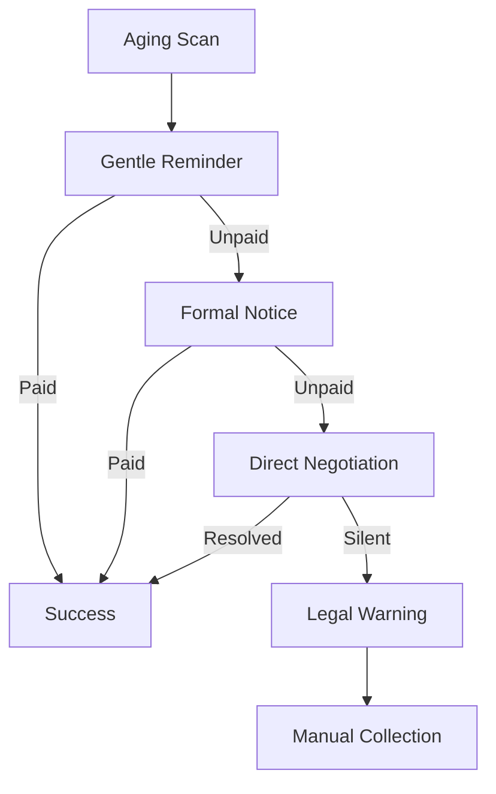

# Workflow: Debt Recovery (Escalation Sequence)

## Goal
To recover overdue payments using a persistent but professional escalation ladder.

## States & Transitions

### 1. Aging-Scan (ENTRY)
- **Action**: Trigger on "Invoice Due Date + 1 Day".
- **Agent**: Debt Recovery AI.
- **Next State**: `Gentle-Reminder`.

### 2. Gentle-Reminder (Day 1-7)
- **Action**: Send a "Soft" reminder via email/WhatsApp.
- **Check**: Payment received?
    - **YES**: Transition to `SUCCESS`.
    - **NO**: Wait 7 days -> Transition to `Formal-Notice`.

### 3. Formal-Notice (Day 8-14)
- **Action**: Send a formal letter referencing the invoice and due date.
- **Tone**: Professional, firm.
- **Check**: Payment received?
    - **NO**: Wait 7 days -> Transition to `Direct-Negotiation`.

### 4. Direct-Negotiation (Day 15-30)
- **Action**: Agent asks if there is a dispute or if a payment plan is needed.
- **Agent**: Debt Recovery AI + Human (if needed).
- **Next State**: `Legal-Warning` (if no response).

### 5. Legal-Warning (Day 31+)
- **Action**: Final notice before external collection.
- **Check**: Final sign-off from SME owner before sending.

---

## Visualization (Mermaid)

