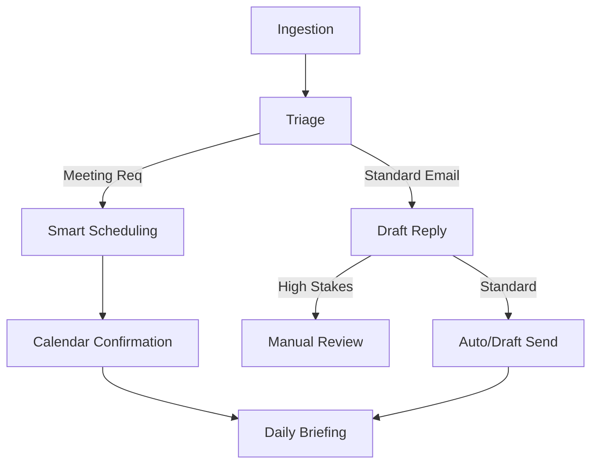

# Workflow: Executive Assistant (Inbox & Schedule)

## Goal
To maintain a "Zero Stress" inbox and an optimized daily schedule for the SME owner.

## States & Transitions

### 1. Ingestion (ENTRY)
- **Action**: Continuous sync of new emails and calendar invites.
- **Agent**: Executive Assistant.
- **Next State**: `Triage`.

### 2. Triage
- **Action**: Sort into categories (Action Required, Information, Spam).
- **Check**: Is it a meeting request?
    - **YES**: Transition to `Smart-Scheduling`.
    - **NO**: Transition to `Draft-Reply`.

### 3. Smart-Scheduling
- **Action**: Propose slots based on `owner_preference_sop`.
- **Logic**: Handle time zone math and buffer times.
- **Next State**: `Calendar-Confirmation`.

### 4. Draft-Reply
- **Action**: Use RAG to draft replies for common queries (Invoices, Intro requests).
- **Check**: High-stakes email?
    - **YES**: Flag for `Manual-Review`.
    - **NO**: Send (if "Auto-reply" is enabled).

### 5. Daily-Briefing (EXIT)
- **Action**: At 8:00 AM daily, send a summary of "Today's Focus".

---

## Visualization (Mermaid)

