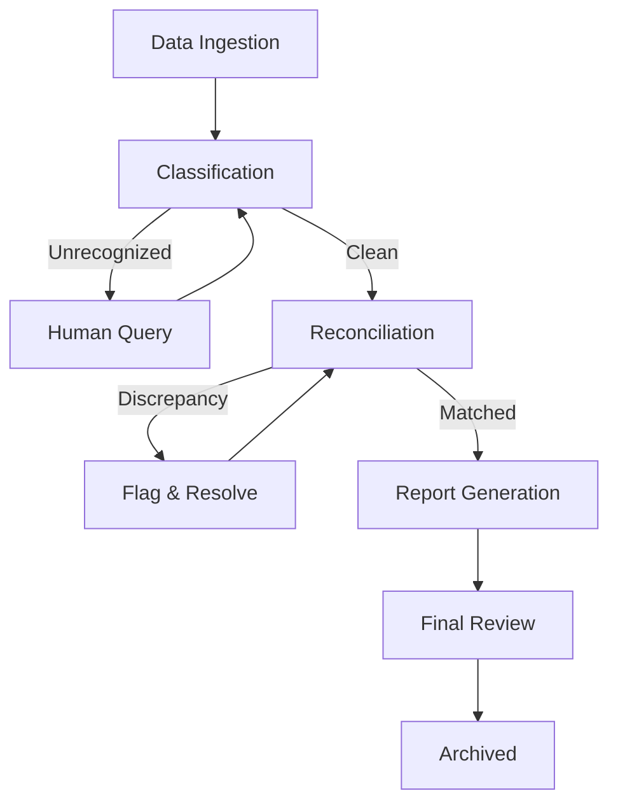

# Workflow: Financial Controller (Audit-Ready Close)

## Goal
To take an SME from raw transaction data to a finalized, audit-ready P&L and Cashflow statement for the month.

## States & Transitions

### 1. Data Ingestion (ENTRY)
- **Action**: Trigger on receipt of Bank Statement (CSV) or end-of-month date.
- **Agent**: Financial Controller.
- **Next State**: `Classification`.

### 2. Classification & Mapping
- **Action**: Map all bank transactions to the Chart of Accounts (COA).
- **Check**: Are there unrecognized transactions?
    - **YES**: Transition to `Human-Query`.
    - **NO**: Transition to `Reconciliation`.

### 3. Human-Query (PAUSED)
- **Action**: Post a query to the Dashboard "Transparency Panel" for the user.
- **Trigger**: User provides classification or memo.
- **Next State**: `Reconciliation`.

### 4. Reconciliation
- **Action**: Cross-reference bank transactions with processed Invoices (from Financial Sentry agent).
- **Check**: Do balances match?
    - **FAIL**: Flag discrepancy in `Audit-Log` and stay in `Reconciliation`.
    - **PASS**: Transition to `Report-Generation`.

### 5. Report-Generation
- **Action**: Generate P&L, Cashflow, and Balance Sheet drafts.
- **Agent**: Business Strategist (for commentary) + Financial Controller.
- **Next State**: `Final-Review`.

### 6. Final-Review
- **Action**: Present "Audit-Ready" package to User for sign-off.
- **Exit**: Move to `ARCHIVED` status once approved.

---

## Visualization (Mermaid)

