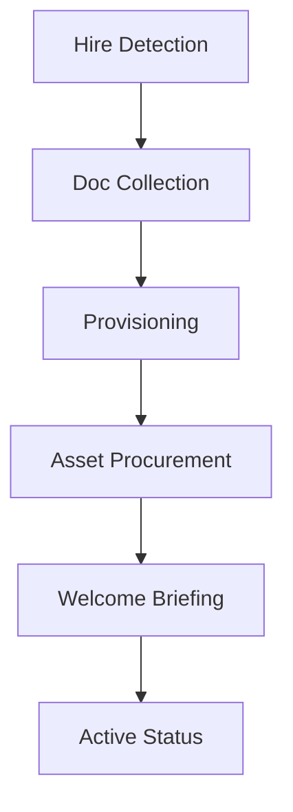

# Workflow: HR Lifecycle (Onboarding Sequence)

## Goal
To automate the administrative "checklist" for a new hire, ensuring a 5-star Day 1 experience.

## States & Transitions

### 1. Hire-Detection (ENTRY)
- **Action**: Triggered when a "Candidate" status changes to "Hired" or a contract is signed.
- **Agent**: HR Lifecycle Agent.
- **Next State**: `Document-Collection`.

### 2. Document-Collection
- **Action**: Send automated portal links for NID, Bank Details, and signed SOPs.
- **Wait**: Until all mandatory docs are uploaded.
- **Next State**: `Provisioning`.

### 3. Provisioning
- **Action**: Orchestrate system access.
- **Steps**:
    - Create GSuite/O365 account.
    - Invite to Slack/Teams.
    - Add to Payroll system.
- **Next State**: `Asset-Procurement`.

### 4. Asset-Procurement
- **Action**: Notify Admin/IT for laptop and ID card prep.
- **Wait**: For "Hardware Ready" confirmation.
- **Next State**: `Welcome-Briefing`.

### 5. Welcome-Briefing
- **Action**: Send "Day 1 Agenda" and welcome email from the CEO.
- **Exit**: Move to `ACTIVE-EMPLOYEE` status.

---

## Visualization (Mermaid)

