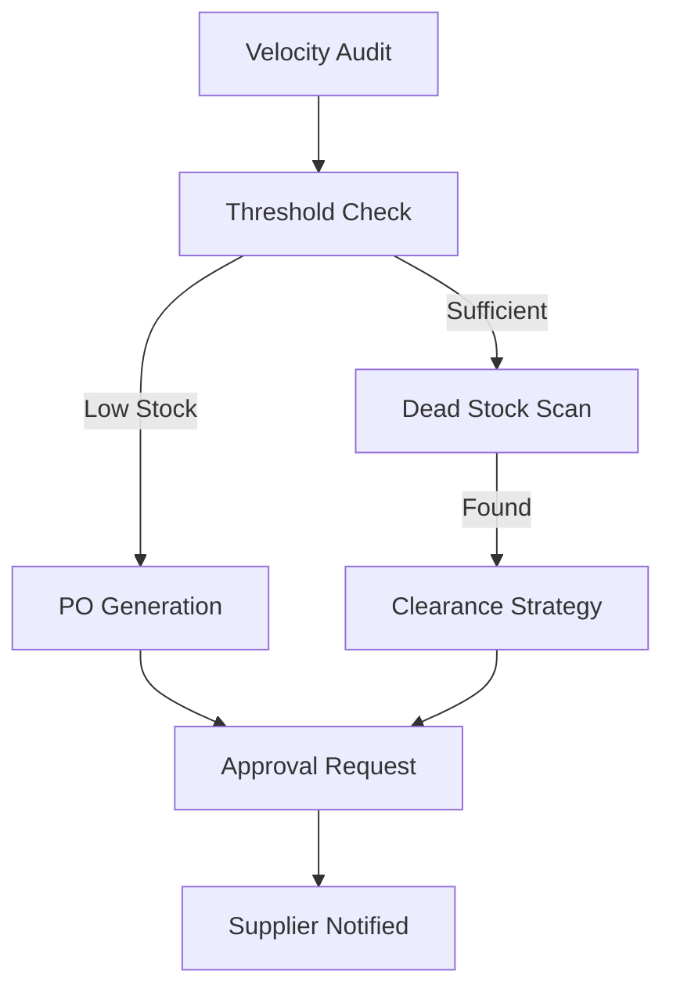

# Workflow: Inventory Optimizer (Supply Chain)

## Goal
To prevent stockouts and minimize dead capital by automating the reorder cycle.

## States & Transitions

### 1. Velocity-Audit (ENTRY)
- **Action**: Nightly scan of sales velocity vs. current stock.
- **Agent**: Inventory Optimizer.
- **Next State**: `Threshold-Check`.

### 2. Threshold-Check
- **Action**: Compare stock levels to "Safety Stock" (Safety stock = Velocity * Lead Time).
- **Check**: Is stock below threshold?
    - **YES**: Transition to `PO-Generation`.
    - **NO**: Transition to `Dead-Stock-Scan`.

### 3. PO-Generation
- **Action**: Create a Purchase Order draft for the specific supplier.
- **Next State**: `Approval-Request`.

### 4. Dead-Stock-Scan
- **Action**: Identify SKUs with 0 sales in 90 days.
- **Agent**: Business Strategist (for promo strategy).
- **Next State**: `Clearance-Strategy`.

### 5. Approval-Request (ACTION)
- **Action**: Present PO and Clearance suggestions to the SME owner.
- **Exit**: Move to `SUPPLIER-NOTIFIED` once approved.

---

## Visualization (Mermaid)

