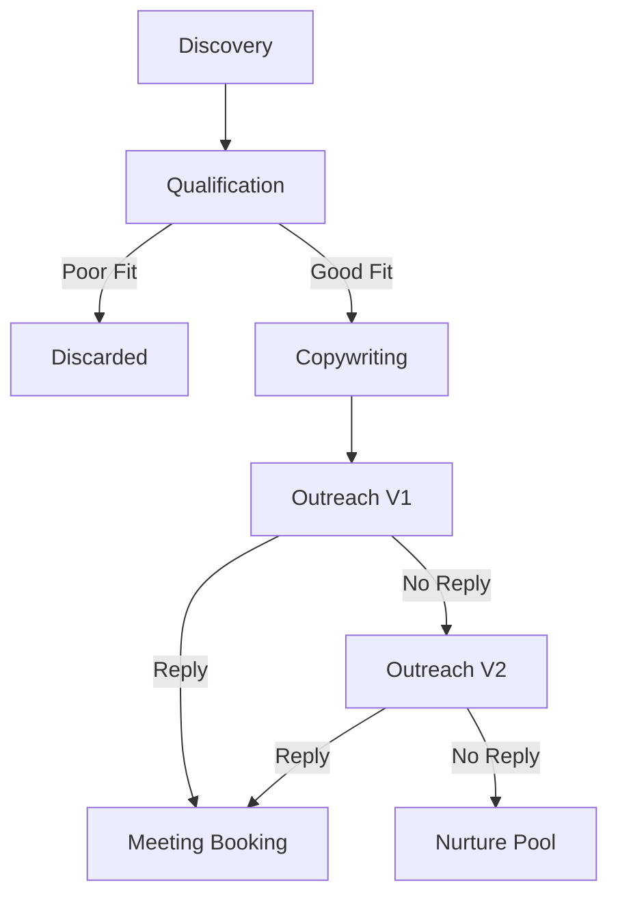

# Workflow: Sales Growth (Lead-to-Meeting)

## Goal
To identify high-intent B2B leads, engage them with personalized content, and secure a sales meeting.

## States & Transitions

### 1. Discovery (ENTRY)
- **Action**: Trigger on target criteria (Industry + Location).
- **Agent**: Sales Growth Agent.
- **Skill**: Lead Scraper.
- **Next State**: `Qualification`.

### 2. Qualification
- **Action**: Visit lead websites, analyze social presence.
- **Filter**: Does the lead meet "Minimum Fit" (Size, Activity)?
    - **NO**: Move to `DISCARDED`.
    - **YES**: Transition to `Copywriting`.

### 3. Copywriting
- **Action**: Draft hyper-personalized outreach.
- **Agent**: Creative Director (Voice) + Sales Growth (Data).
- **Next State**: `Outreach-V1`.

### 4. Outreach-V1
- **Action**: Send initial email or LinkedIn message.
- **Wait**: 3 Days for response.
    - **RESPONSE**: Transition to `Meeting-Booking`.
    - **NO RESPONSE**: Transition to `Outreach-V2` (The Nudge).

### 5. Outreach-V2 (The Nudge)
- **Action**: Send a diplomatic follow-up referencing the first message.
- **Wait**: 5 Days.
    - **NO RESPONSE**: Move to `NURTURE-POOL`.

### 6. Meeting-Booking
- **Action**: Coordinate calendar.
- **Agent**: Executive Assistant.
- **Exit**: Meeting confirmed in Owner's calendar.

---

## Visualization (Mermaid)

