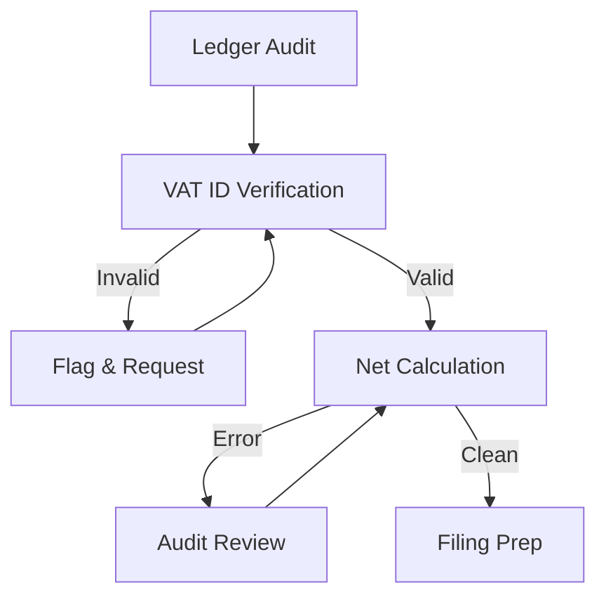

# Workflow: Tax Compliance (VAT Reconciliation)

## Goal
To automate the quarterly/monthly VAT reconciliation process and ensure the SME is ready for tax filing without manual errors.

## States & Transitions

### 1. Ledger-Audit (ENTRY)
- **Action**: Periodically scan sales and purchase ledgers for tax flags.
- **Agent**: Tax Compliance Agent.
- **Next State**: `VAT-ID-Verification`.

### 2. VAT-ID-Verification
- **Action**: Verify VAT numbers of all major vendors/customers against national databases.
- **Check**: Are any IDs invalid?
    - **YES**: Transition to `Flag-Invalid-ID`.
    - **NO**: Transition to `Net-Calculation`.

### 3. Flag-Invalid-ID (ACTION)
- **Action**: Notify the user via the Dashboard and request an updated tax invoice from the vendor.
- **Wait**: Until document is updated.
- **Next State**: `Net-Calculation`.

### 4. Net-Calculation
- **Action**: Calculate Output Tax (Sales) minus Input Tax (Purchases).
- **Check**: Are there exemptions or reduced rates correctly applied?
    - **FAIL**: Flag for `Audit-Review`.
    - **PASS**: Transition to `Filing-Prep`.

### 5. Filing-Prep
- **Action**: Prepare the final VAT Return summary.
- **Exit**: Document ready for submission to Tax Portal.

---

## Visualization (Mermaid)

